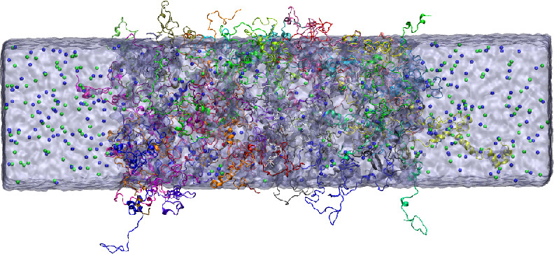

## Tutorial 1: FUS LC slab system

This tutorial reproduces a classic condensate setup from Reference [1]. The original study used the HPS force field, placed 40 monomers in a 10 × 10 × 40 box to form FUS LC and LAF1 RGG condensates, performed backmapping with PULCHRA, optimized with CAMPARI (implicit solvent MC in vacuum), and ran 2 μs atomistic simulations with Amber ff03ws.

2020 JPCB abstract figure:



Here we build a 10 × 10 × 40 system containing 40 FUS LC monomers using CondenSimAdapter. We use `calvados` for CG, `amber99sbws-stqp` for AA, and `cg2all` for backmapping.

## Step 0: Activate environment and set up directories

```bash
conda activate CSA
cd Tutorials/Tutorial_1_FUS_slab
mkdir run
cd run
adapter -h
```

A help message will be displayed, introducing CondenSimAdapter. From this, we can see that a typical workflow consists of the following steps:

### Typical workflow

| Step | Command | Description |
| --- | --- | --- |
| 1 | `adapter init my_project` | Initialize a new project |
| 2 | `adapter cg -f config.yaml` | Run coarse-grained simulation |
| 3 | `adapter backmap -f config.yaml` | Backmap to all-atom representation |
| 4 | `adapter minimize -f config.yaml` | Energy minimization and explicit solvation (optional) |

Installation: please refer to the main `README.md` for setup instructions.

## Step 1: Create the configuration file with `adapter init`

Based on the system we want to simulate, use `adapter init` to generate the YAML. This YAML is the core file for managing the full multiscale workflow and will be used throughout the entire multiscale simulation stage:

```bash
adapter init -h
adapter init -ff calvados --type idp -tp slab -n 40 -t 100 -b 10 10 40 -T 298 -I 0.15 --name FUS_LC
ls
# FUS_LC.yaml
```

The generated `FUS_LC.yaml` looks like this:

```yaml
# CG Simulation Configuration
# Generated by: adapter init
#
# Available CG force fields:
#   - calvados: CALVADOS force field (default)
#   - hps_urry: HPS Urry model
#   - cocomo: COCOMO2
#   - mpipi_recharged: Mpipi_recharged
#
# Geometry types:
#   - grid: Continuous dense phase with periodic boundaries in x, y, z
#   - slab: Periodic boundaries in x, y and interfaces with dilute phase along z
#   - droplet: Spherical droplet confined within radius r, surrounded by dilute phase

# System information
system_name: FUS_LC

# CG force field
force_field: calvados   # calvados | hps_urry | cocomo | mpipi_recharged

# Environment parameters
box: [10.0, 10.0, 40.0]   # nm (x, y, z)
temperature: 298.0         # Kelvin
ionic: 0.15                # Molar (ionic strength)

# Topology type:
#   - grid: Continuous dense phase with periodic boundaries in x, y, z.
#   - droplet: Spherical droplet confined within radius r, surrounded by dilute phase
#   - slab: Geometry with periodic boundaries in x, y and interfaces with dilute phase along z.
topol: slab

# CG simulation parameters
simulation:
  steps: 10000000   # 100.0 ns (1 step = 10 fs)
  wfreq: 5000        # write frequency - save per 50 ps
  verbose: true

# Component definitions
components:
  - name: protein_A
    type: IDP          # IDP or MDP
    nmol: 40           # number of molecules (can be adjusted per component)
    ffasta: input/protein_A.fasta
```

### Update the component section

Edit `components` so the `name` matches the FASTA header (the `>` line):

```yaml
components:
  - name: FUS_LC
    type: IDP          # IDP or MDP
    nmol: 40           # number of molecules (can be adjusted per component)
    ffasta: ../input/sequences.fasta
```

## Step 2: Run CG simulation with `adapter cg`

```bash
adapter cg -f FUS_LC.yaml
```

The terminal will display real-time simulation progress, including system information and energy metrics. A successful start looks like this:

```
......
Component 0, Molecule 36: FUS_LC
Component 0, Molecule 37: FUS_LC
Component 0, Molecule 38: FUS_LC
Component 0, Molecule 39: FUS_LC
6520 particles in the system
---------- FORCES ----------
ah: 6520 particles, 6480 exclusions
yu: 6520 particles, 6480 exclusions
0.01 /ps 298.0 K
Running on CUDA
No checkpoint file restart.chk found: Starting from new system configuration
Writing trajectory to new file FUS_LC_CG/raw/FUS_LC.xtc
Minimizing energy.
STARTING SIMULATION
 50%|#########################################5| 5/10 [05:09<05:09, 61.95s/it]
```

When you see the progress bar and "STARTING SIMULATION", the CG simulation has started correctly.

After the run finishes, you should see output like:

- `trajectory.xtc`
- `final.pdb` (copied from `FUS_LC_20262601_17h57m02s.pdb`)
- `simulation.log`
- CALVADOS simulation completed
- Simulation completed
- Output: `CondenSimAdapter/Tutorials/Tutorial_1_FUS_slab/run/FUS_LC_CG`
- Trajectory: `trajectory.xtc` (55.3 MB)

The final structure is `run/FUS_LC_CG/final.pdb`. Different CG force fields may produce slightly different structures, but the output will always include a `final.pdb`. An example result from a test run is shown below:


## Step 3: Backmap CG coordinates to all-atom with `adapter backmap`

For a standard run that uses the same YAML as the CG stage, simply run:

```bash
adapter backmap -f FUS_LC.yaml
```

This will backmap the default CG output directory `{system_name}_CG/final.pdb` and write results to `{system_name}_backmap/final.aa.pdb`.

If you want to backmap a different frame or a user-provided PDB, pass it with `-i`.

Example console output:

```bash
adapter backmap -f FUS_LC.yaml

============================================================
Backmap CG to All-Atom
============================================================

  Input: FUS_LC_CG
  Config: FUS_LC.yaml
  Device: cpu (fixed)
Loading checkpoint from: /mnt/hdd1/home/tianxj/code/ms2main/CondenSimAdapter/CondenSimAdapter/extern/ms2_cg2all/model/CalphaBasedModel.ckpt
  SLAB topology detected: centering condensate in z direction...
    Protein COM z: 16.82 nm
    Box z center: 20.00 nm
    Offset (z only): +3.18 nm
    Condensate centered in z direction
  Backmap completed
  Input PDB: FUS_LC_CG
  Output PDB: FUS_LC_backmap/final.aa.pdb
  Model type: CalphaBasedModel

  Success
```

Backmapping completes successfully, and for slab geometry the condensate is centered along the z direction. Across the four CG force fields, the default is `CalphaBasedModel`, except when using CALVADOS for MDP systems, which uses `ResidueBasedModel` (residues mapped to their center of mass). When running from YAML, the model type is detected automatically.


## Step 4: Minimize and build explicit solvent with `adapter minimize`

To see all options:

```bash
adapter minimize -h
```

For this system, we run minimization with the AMBER99SB-WS (STQp) force field and explicit solvent at 0.15 M salt:

```bash
adapter minimize -f FUS_LC.yaml -ff 3 --salt-conc 0.15 --solvate
```

If you hit a rare atom-count mismatch (usually from `pdb2gmx` residue typing), retry with the troubleshooting flags:

```bash
adapter minimize -f FUS_LC.yaml -ff 3 --salt-conc 0.15 --solvate --no-disulfide --his-type 0
```

Example output (truncated):

```text
[Step 6] Explicit solvation...
  Water model: tip4p2005s (gmx -cs: tip4p)
  Ion concentration: 0.15 M
  Adding water box...
  Water box added
  Preparing for ion addition...
  Adding ions...
  Ions added
  Final structure (solvated): minimize_final_solvated.gro
  Final topology: topol.top

[Step 7] Add chain label for structure for better visualization...
  Final structure (PDB): minimize_final_solvated.pdb

  Minimization completed
  Input PDB: FUS_LC_backmap
  Output PDB: CondenSimAdapter/Tutorials/Tutorial_1_FUS_slab/run/FUS_LC_minimize/minimize_final_solvated.pdb

  Success
```

Key outputs:

- `topol.top`
- `minimize_final_solvated.gro`
- `minimize_final_solvated.pdb` (same coordinates as `.gro`, plus chain labels for visualization)

At the end of `topol.top` you should see the water and ion includes and the final molecule counts, for example:

```text
; Include water topology
#include "./amber99sbws-STQp.ff/tip4p2005s.itp"

; Include topology for ions
#include "./amber99sbws-STQp.ff/ions.itp"

[ system ]
; Name
FUS_LC in water

[ molecules ]
; name	number
FUS_LC	40
SOL         98779
NA               441
CL               361
```

Example minimized structure (explicit solvent):


## Step 5: Run simulation with GROMACS

From here on, the workflow follows standard GROMACS practice. A typical sequence is:

1. Steepest-descent energy minimization (`emtol ~ 2000`)
2. Conjugate-gradient minimization (`emtol ~ 500–1000`)
3. Short relaxation run with a small timestep (0.5–1.0 fs, 50–500 ps)
4. Pre-equilibration with the normal timestep (2 fs)
5. Production simulation

All required `.mdp` files for this system are provided in `Tutorials/Tutorial_1_FUS_slab/input`.

Finally, your `run` directory should look like this:

```text
run/
├── FUS_LC.yaml
├── mdout.mdp
├── FUS_LC_CG/
│   ├── final.pdb
│   ├── simulation.log
│   ├── trajectory.xtc
│   ├── input/
│   └── raw/
├── FUS_LC_backmap/
│   └── final.aa.pdb
├── FUS_LC_minimize/
│   ├── minimize_final.pdb
│   ├── minimize_final_solvated.gro
│   ├── minimize_final_solvated.pdb
│   ├── topol.top
│   ├── amber99sbws-STQp.ff/
│   ├── minimize/
│   ├── solvate/
│   ├── structure/
│   └── topology/
```

## Reference

[1] **Molecular Details of Protein Condensates Probed by Microsecond Long Atomistic Simulations**  
Wenwei Zheng, Gregory L. Dignon, Nina Jovic, Xichen Xu, Roshan M. Regy, Nicolas L. Fawzi, Young C. Kim, Robert B. Best, and Jeetain Mittal  
*J. Phys. Chem. B* **2020**, *124* (51), 11671–11679  
DOI: [10.1021/acs.jpcb.0c10489](https://doi.org/10.1021/acs.jpcb.0c10489)
